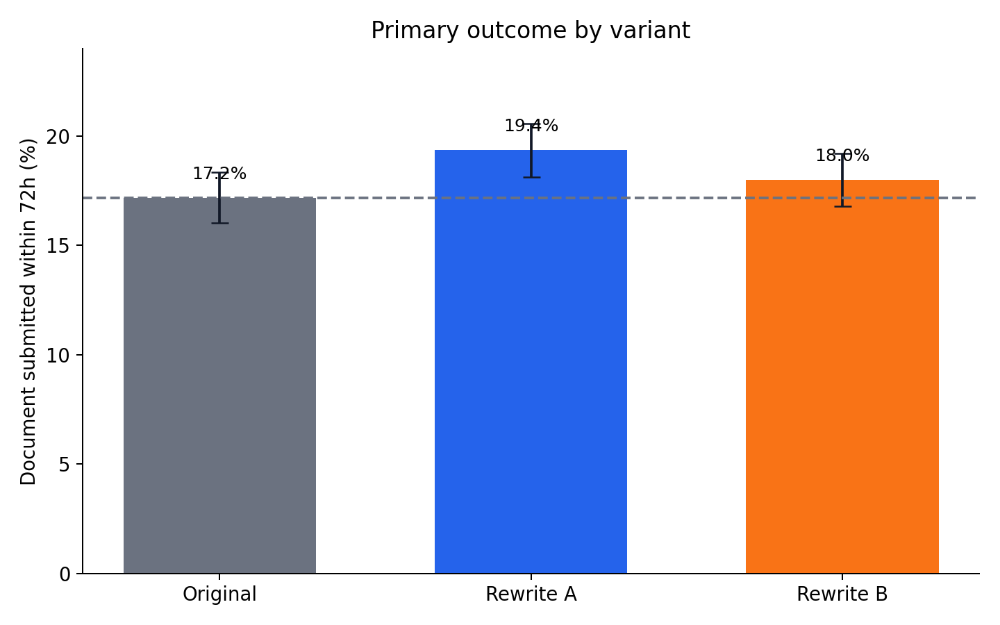
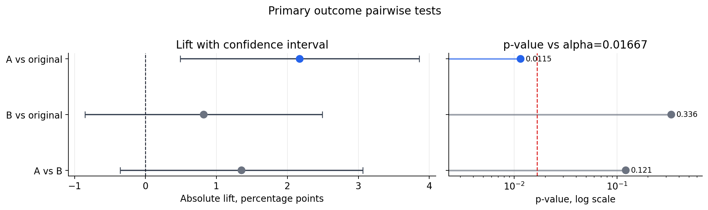
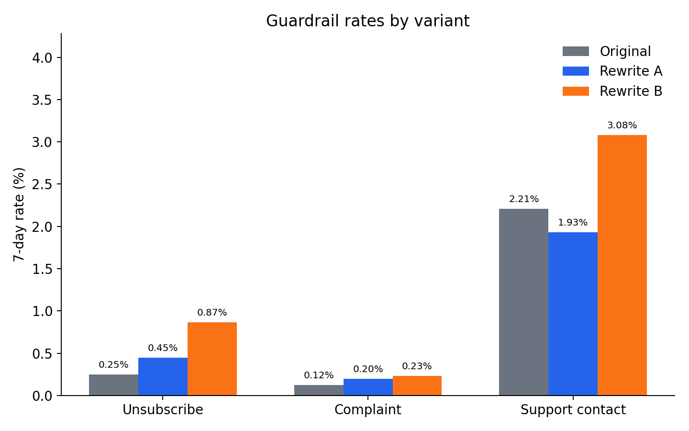
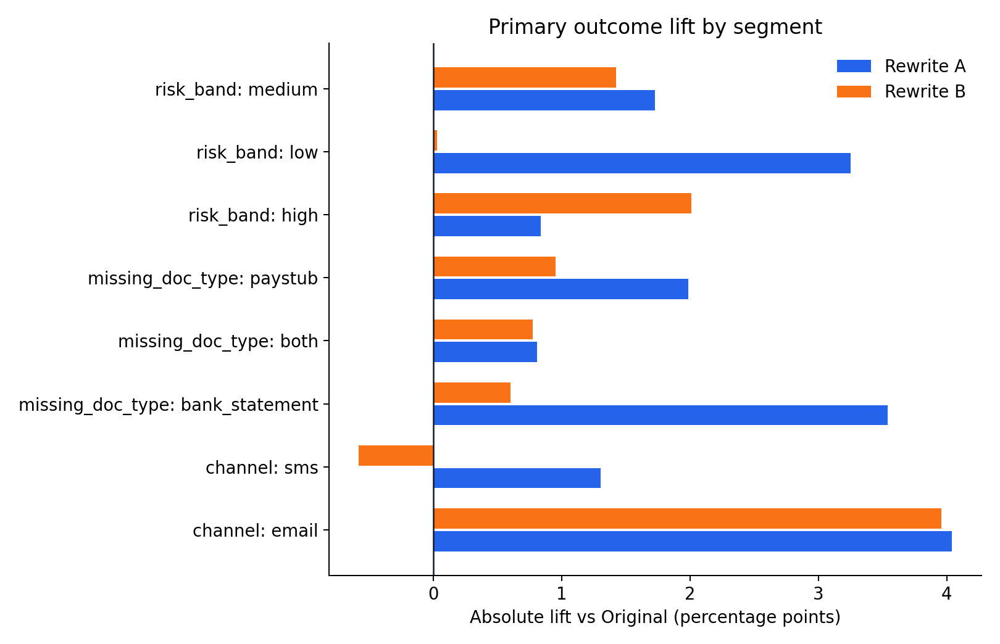
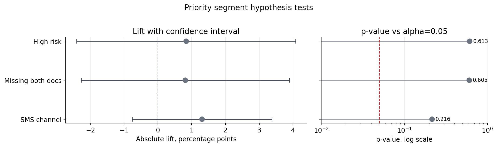

# Lending Message A/B Test

## Context

A lending client is testing LLM-rewritten outreach messages for applicants who started a loan application but have not yet uploaded required income documents.

Input csv includes experiment results for three message variants:

- **Original**
- **LLM Rewrite A**
- **LLM Rewrite B**

The business goal is to improve the main borrower action without increasing negative signals.

## Repository Contents

| Path | Purpose |
|---|---|
| `AB_Lending_Message_Part_A_B.ipynb` | Clean notebook for Part A and Part B |
| `output_report.html` | Standalone browser report with charts and recommendation |
| `data/applicants_experiment.csv` | Input applicant-level experiment data |
| `figures/` | Generated PNG charts |
| `scripts/generate_analysis_outputs.py` | Rebuilds charts, notebook, and HTML report |
| `requirements.txt` | Python dependencies |

## Notebook Helpers

The notebook includes two reusable helpers for the statistical workflow:

- `hypothesis_test(...)` runs a two-sided two-proportion z-test and returns a one-row pandas DataFrame with conversion rates, absolute lift, relative lift, p-value, and the confidence interval for the treatment-control difference.
- `plot_hypothesis_results(test_results, significance_level=0.05, title=...)` visualizes the output from `hypothesis_test` or a concatenated test-results DataFrame. It plots absolute lift with confidence intervals and p-values against the input significance threshold.

For multiple tests, concatenate the one-row outputs:

```python
primary_tests = pd.concat([
    hypothesis_test("original", "A", primary),
    hypothesis_test("original", "B", primary),
    hypothesis_test("B", "A", primary),
], ignore_index=True)
```

Then visualize the results:

```python
plot_hypothesis_results(
    primary_tests,
    significance_level=0.05 / 3,
    title="Primary outcome pairwise tests",
)
```

The same visualization can be used for segment-level tests. If the input DataFrame has a `segment` column, that column is used as the y-axis label.

## Primary Outcome

The primary outcome is `doc_submitted_72h`.

This is the best primary metric because the business goal is not just engagement, but getting applicants to submit the missing income documentation needed to continue the loan application. Clicks and responses are useful diagnostics, but document submission is closer to the borrower action the experiment is trying to improve.

The analysis uses all randomized applicants in `data/applicants_experiment.csv`.

## Quality Checks

The sample-ratio mismatch check does not show evidence of assignment imbalance across the three variants: SRM chi-square p-value = 0.3671. The observed arm sizes are close to the expected 4,000 applicants per arm: Original 4,033, Rewrite A 4,040, and Rewrite B 3,927.

Randomization balance checks for `channel`, `risk_band`, and `missing_doc_type` also look acceptable. The chi-square p-values are 0.2467, 0.4401, and 0.3339 respectively, with maximum cell-share spreads under 2 percentage points.

## Key Result



| Variant | Randomized n | Submitted docs | Rate | Abs. lift vs Original | Rel. lift vs Original |
|---|---:|---:|---:|---:|---:|
| Original | 4,033 | 693 | 17.18% | 0.00 pp | 0.00% |
| Rewrite A | 4,040 | 782 | 19.36% | +2.17 pp | +12.65% |
| Rewrite B | 3,927 | 707 | 18.00% | +0.82 pp | +4.77% |

Pairwise proportion tests:

| Comparison | Abs. lift | 95% CI | p-value | Bonferroni p-value |
|---|---:|---:|---:|---:|
| A vs Original | +2.17 pp | +0.49 to +3.86 pp | 0.0115 | 0.0346 |
| B vs Original | +0.82 pp | -0.85 to +2.49 pp | 0.3365 | 1.0000 |
| A vs B | +1.35 pp | -0.36 to +3.06 pp | 0.1215 | 0.3644 |

The plot below shows the same pairwise tests visually: lift confidence intervals on the left and p-values compared with the Bonferroni-adjusted significance level on the right.



Multiple-testing policy: the three planned primary-outcome pairwise tests use Bonferroni correction. Guardrail and segment tests are diagnostic checks and should be interpreted directionally rather than as winner-selection tests.

## Power Analysis

For the observed A vs Original effect, Cohen's h is 0.0563. With the observed sample sizes, achieved power is about 71.5% at alpha 0.05 and about 55.3% after the Bonferroni-adjusted alpha of 0.0167. To reach 80% power at the adjusted alpha for an effect of this size, the experiment would need about 6,609 Original applicants and 6,620 Rewrite A applicants.

## Delivered-Only Sensitivity

The primary analysis uses all randomized applicants. As a sensitivity check, restricting to delivered messages gives the same directional conclusion: Rewrite A improves `doc_submitted_72h` versus Original from 17.51% to 19.85%, a +2.33 percentage-point absolute lift. The delivered-only A vs Original p-value is 0.0078, with Bonferroni-adjusted p-value 0.0233.

## Guardrails



| Variant | Unsubscribe rate | Complaint rate | Support contact rate |
|---|---:|---:|---:|
| Original | 0.25% | 0.13% | 2.25% |
| Rewrite A | 0.46% | 0.20% | 1.98% |
| Rewrite B | 0.87% | 0.23% | 3.08% |

Rewrite A improves the primary outcome and does not show a material guardrail problem. Rewrite B has weaker primary-outcome lift and worse guardrails, especially unsubscribes and support contacts.

## Segment Review



Rewrite A is directionally positive across the reviewed segments. The largest gains appear in email, low-risk applicants, and applicants missing bank statements. Smaller lifts appear for high-risk applicants and applicants missing both document types, so those segments should be monitored during rollout.

The priority segment hypothesis tests below show A vs Original for the watch areas called out in the notebook. These segment-level confidence intervals are wide and cross zero, so they should be treated as directional rather than definitive.



## Recommendation

Recommend Rewrite A as the winner.

Use a measured full rollout rather than rolling out Rewrite B or stopping the test. Rewrite A has the strongest primary-outcome performance: +2.17 percentage points versus Original, a +12.65% relative lift, with a positive confidence interval and statistical evidence that remains reliable after correcting for the three pairwise tests.

Rewrite B should not be rolled out. Its lift over Original is smaller and not statistically reliable, while unsubscribe and support-contact guardrails worsen.

Main limitations:

- The analysis uses all randomized applicants rather than filtering to delivered applicants.
- Segment-level results are directional because each subgroup has less sample than the full experiment.
- Guardrail events are rare, especially complaints, so small count changes can look large in percentage terms.

Next steps:

- Roll out Rewrite A with guardrail monitoring.
- Keep reporting unsubscribes, complaints, and support contacts during rollout.
- Retest or tune the message for weaker segments, especially high-risk applicants and applicants missing both document types.

## Reproduce

```bash
pip install -r requirements.txt
python scripts/generate_analysis_outputs.py
```

Then open `AB_Lending_Message_Part_A_B.ipynb` or review the generated files in `figures/`.
